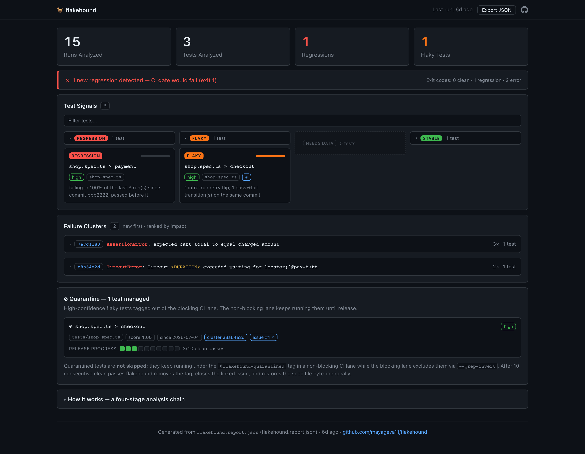

# flakehound 🐕

[](https://www.npmjs.com/package/flakehound)
[](https://github.com/mayageva11/flakehound/actions/workflows/ci.yml)


**Live dashboard:** [mayageva11.github.io/flakehound](https://mayageva11.github.io/flakehound/) — rendered from a real `flakehound.report.json`.

**Jump to:** [Quick start](#quick-start) · [Commands](#commands) · [Dashboard](#dashboard) · [CI integration](#ci-integration) · [Configuration](#configuration) · [Quarantine](#quarantine) · [Architecture](#architecture)

**Root-cause analysis for flaky tests.** Existing tools count pass/fail and tell you *that* a test is flaky — flakehound clusters failures by their underlying cause and tells you **"23 failures over 3 weeks = 4 unique bugs"**, separates genuinely flaky tests from hard regressions, and gates your CI on *new* regressions only.

## At a glance

- **Detects flakiness by behavior, not fail rate** — pass↔fail flips on the *same commit* and retry flips within a run ([how it works](#how-it-works))
- **Separates flaky from broken** — a test failing 100% since one commit is a *regression*; the two are mutually exclusive ([how it works](#how-it-works))
- **Clusters failures by root cause** — "23 failures = 4 bugs"; one cluster = one bug, even when it spans many tests ([how it works](#how-it-works))
- **Gates CI on *new* regressions only** — fails once when a bug lands, not on every run until it's fixed ([CI integration](#ci-integration))
- **Quarantines flaky tests — and releases them itself** — reviewable git edits, one GitHub issue per test, auto-release after N clean runs ([quarantine](#quarantine))
- **A dashboard built for triage** — new failures first, signals grouped by verdict, one line per cluster ([dashboard](#dashboard))

Input is JUnit XML — the one format every test runner and CI already emits.

```
flakehound — 12 test runs across 4 files, 3 tests analyzed

Regressions (1)
  ✗ shop.spec.ts > payment — broken since bbb2222
      failing in 100% of the last 3 run(s) since commit bbb2222; passed before it

Flaky tests — quarantine candidates (1)
  ~ shop.spec.ts > checkout — score 1.00 (medium confidence)
      1 pass↔fail transition(s) on the same commit

Failure clusters (2) — ranked by impact
  1. [7a7c11808d52] 3 occurrence(s) across 1 test(s)
      AssertionError: expected cart total to equal charged amount at PaymentPage.verify (payment-page.ts:<N>:<N>)
  2. [a8a64e2d45ec] 2 occurrence(s) across 1 test(s)
      TimeoutError: Timeout <DURATION> exceeded waiting for locator('#pay-button') at CheckoutPage.pay (checkout-page.ts:<N>:<N>)

CI gate: 1 new, 0 known, 0 resolved regression(s)
```

## How it works

1. **Ingest** — parses JUnit XML (the universal CI format: Jest, Playwright, pytest, JUnit) across a history of runs.
2. **Signal** — scores flakiness by *transition frequency* (pass↔fail flips on the same commit, retry flips within a run), **not** naive fail rate. A test failing 100% since a specific commit is a **regression**, not flaky — the two are mutually exclusive.
3. **Cluster** — normalizes stack traces (strips line numbers, addresses, durations, path prefixes — keeps error classes, function names, filenames) and groups structurally identical failures. Similarity is **head-weighted**: error-class/message tokens weigh double, so the bug's identity dominates shared library frames. Guiding principle: *prefer false-split over false-merge* — the tool exists to surface bugs, never to hide them.
4. **Interpret** (optional) — sends each cluster's representative trace to a pluggable inference provider — a local Ollama model when one is reachable (zero cost, nothing leaves your machine), else the Claude API when `ANTHROPIC_API_KEY` is set — for a one-line root-cause hypothesis. The deterministic core works identically without either.
5. **Report + gate** — terminal report, `flakehound.report.json` artifact, and exit codes usable as a CI gate. With a baseline, clusters are also diffed — a **NEW** cluster means a bug shape never seen before (informational; only new *regressions* fail the gate). `flakehound explain <testId>` prints any test's run-by-run story.

## Dashboard

```sh
npx flakehound analyze --html    # writes flakehound.report.html next to the JSON
```

One **self-contained HTML file** with the report embedded — open it from disk (`file://` works, no server), attach it as a CI artifact, or publish it to GitHub Pages. Set a path with `--html <path>` or in config (`html: { output: 'docs/index.html' }`). The dashboard also works the classic way — the same page served next to a `flakehound.report.json` renders that instead. Live examples: [the tool's own report](https://mayageva11.github.io/flakehound/) · [the demo's](https://mayageva11.github.io/flakehound-demo/).



Laid out for the developer staring at a red CI run:

- **New failures first** — clusters absent from the baseline wear a red `NEW` chip, sort to the top, and start expanded; known clusters collapse to one scannable line each (id · error head · occurrences · tests affected).
- **Signals grouped by verdict** — regression / flaky / needs-data / stable side by side; problem groups start open, the long tail collapsed and lazily rendered, so the page stays fast at 10,000 tests.
- **Cross-linked** — click a test inside a cluster to jump to its run-by-run history; click a quarantined test's cluster chip to jump to its trace.
- **Quarantine panel** — every quarantined test shows its progress toward auto-release.
- **Filter with `/`** — searches test ids, traces, and hypotheses, including inside collapsed groups.

## Quick start

```sh
# 1. Install (or run everything through npx, no install needed)
npm install --save-dev flakehound

# 2. Point your test runner at JUnit XML output — Jest, Playwright,
#    pytest, JUnit, Surefire… every major runner emits it.

# 3. Scaffold a commented config (optional — sensible defaults otherwise)
npx flakehound init

# 4. Analyze your run history (--html also emits the dashboard, see below)
npx flakehound analyze --html
```

That's the whole integration: JUnit XML in, root-cause analysis out. No plugins,
no per-runner adapters, no account.

## Commands

| Command | What it does |
|---|---|
| `flakehound analyze` | Analyze the JUnit XML history: score flakiness, isolate regressions, cluster failures, gate CI |
| `flakehound explain <testId>` | One test's run-by-run story: history table, classification reasoning, its clusters |
| `flakehound quarantine` | Tag high-confidence flaky tests in their spec files, file tracking issues, auto-release when stable — dry-run by default ([details](#quarantine)) |
| `flakehound init` | Scaffold a fully commented `flakehound.config.ts` (never overwrites; `--force` to replace) |

### `analyze` flags

| Flag | Meaning |
|---|---|
| `-i, --input <glob>` | JUnit XML glob (overrides config) |
| `-b, --baseline <path>` | previous report — regressions in it are *known* and don't re-fail the gate |
| `--json <path>` | report artifact path (default `flakehound.report.json`) |
| `--html [path]` | also emit the self-contained HTML dashboard (default `flakehound.report.html`) |
| `--no-ai` | disable AI interpretation |
| `-c, --config <path>` | explicit config file |

**Exit codes:** `0` clean · `1` new regression(s) detected · `2` tool error (bad XML, bad config, or an input glob that matched **zero** files — a QA gate never silently passes on no evidence) — so CI can tell "found a bug" from "tool broke".

## Integration contract (run metadata)

Drop your JUnit XML files in a folder — flakehound works with zero metadata. Add more for commit-aware analysis; per XML file, the resolution chain is:

1. **Sidecar** `<name>.meta.json` next to the XML *(best — enables everything)*:
   ```json
   { "commitSha": "a1b2c3d", "timestamp": "2026-07-01T10:00:00Z", "runnerId": "ubuntu-22" }
   ```
2. **Directory name** convention `{sha}_{timestamp}/`, e.g. `a1b2c3d_2026-07-01T10-00/junit.xml`
3. **File mtime** — timestamp only; commit-aware signals degrade gracefully (flakiness falls back to time-ordered flips at low confidence; regression detection reports `insufficient-metadata` instead of guessing).

## CI integration

flakehound is CI-agnostic by construction: its only input is JUnit XML — the one format every CI ecosystem already emits (GitHub Actions, Jenkins, GitLab CI, CircleCI, TeamCity, …). There is no per-CI plugin and no per-CI code path. Integrating any CI means expressing three steps in that CI's native idiom:

1. **Run tests → JUnit XML** into a dated history folder (plus the optional metadata sidecar for commit-aware analysis).
2. **`flakehound analyze`** over the history, with the previous report as `--baseline`.
3. **Persist `flakehound.report.json`** for the next run, and act on the exit code (`0` clean · `1` new regression · `2` tool error).

The gate then fails **once** when a regression lands — not on every run until it's fixed. Two worked examples:

### GitHub Actions — the reusable action

The repo doubles as a composite action: it runs the analysis, writes a job
summary, gates on new regressions, and (optionally) upserts one PR comment with
the verdict, run strips, and clusters:

```yaml
- uses: mayageva11/flakehound@main
  with:
    input-glob: 'test-results/**/*.xml'
    baseline: flakehound.report.json   # optional
    comment: 'true'                    # PR comment on pull_request events
    quarantine: 'true'                 # dry-run quarantine report (never edits your repo)
```

Outputs: `exit-code` (`0`/`1`/`2`), `report-path`, and `quarantine-pending`
(`'true'` when the dry-run found tests to quarantine or release — gate a
follow-up job on it, or run `npx flakehound quarantine --pr` yourself). Set
`fail-on-new-regressions: 'false'` to observe without gating. The `quarantine`
input is strictly read-only reporting: the job summary and PR comment gain a
"⊘ Quarantine (dry-run)" section, and your repo is never modified.

Set `cache-baseline: 'true'` and the action persists the report across runs for
you — no hand-rolled `actions/cache` — using a concurrency-safe key scheme (see
[Concurrency & the CI cache](#concurrency--the-ci-cache)). `cache-key-prefix`
(default `flakehound-report`) names the cache; branch and run id are appended.

### GitHub Actions — raw CLI

Baseline persistence via the cache. The key is **unique per run** (so concurrent
branches or matrix jobs never overwrite each other) and `restore-keys`
**prefix-matches the newest** prior report for the branch, then any branch in
scope — an append-only cache log, not a single mutable slot:

```yaml
- name: Restore previous flakehound report
  uses: actions/cache/restore@v4
  with:
    path: flakehound.report.json
    key: flakehound-report-${{ github.ref_name }}-${{ github.run_id }}-${{ github.run_attempt }}
    restore-keys: |
      flakehound-report-${{ github.ref_name }}-
      flakehound-report-

- name: flakehound gate
  run: npx flakehound analyze --input 'test-results/**/*.xml' --baseline flakehound.report.json

- name: Save report for next run
  if: always()
  uses: actions/cache/save@v4
  with:
    path: flakehound.report.json
    key: flakehound-report-${{ github.ref_name }}-${{ github.run_id }}-${{ github.run_attempt }}
```

(The reusable action does all of this for you with `cache-baseline: 'true'`.)

### Jenkins (declarative pipeline)

Full worked example: [`examples/jenkins/Jenkinsfile`](examples/jenkins/Jenkinsfile) — including writing the metadata sidecar from `$GIT_COMMIT` / `$NODE_NAME`. Baseline persistence uses build artifacts instead of a cache; the essentials:

```groovy
// previous build's report → this build's baseline (requires the copyartifact plugin)
copyArtifacts projectName: env.JOB_NAME, selector: lastCompleted(),
              filter: 'flakehound.report.json', optional: true
sh 'mv flakehound.report.json flakehound.baseline.json 2>/dev/null || true'

def rc = sh(returnStatus: true, script:
  "npx flakehound analyze --input 'flakehound-history/**/*.xml' " +
  "--baseline flakehound.baseline.json --json flakehound.report.json")
if (rc == 1) { error 'flakehound: new regression detected' }
else if (rc == 2) { unstable 'flakehound: tool error' }

// post { always { archiveArtifacts artifacts: 'flakehound.report.json', allowEmptyArchive: true } }
```

The one non-obvious choice is `lastCompleted()` rather than `lastSuccessful()`: a build that failed *because of* a new regression still archived its report, and that report is exactly what turns the regression from "new" (fails every build) into "known" (fails once, stays visible).

No baseline anywhere (first run, cache miss, missing artifact)? flakehound **fails safe**: every regression counts as new.

### Concurrency & the CI cache

flakehound's history is already **collision-free by construction**: each run's
JUnit XML lands under a unique `{sha}_{timestamp}/` path, and `analyze` reads the
whole folder and writes a fresh report — there is no single accumulating file for
two runs to fight over *inside the tool*. The only place a race can appear is the
**transport** you use to carry the previous report forward as the baseline, when
many jobs (parallel branches, PRs, matrix legs) funnel through **one static cache
key**:

| Transport | Static key behaviour | Fix |
|-----------|----------------------|-----|
| **GitLab CI cache** | Re-uploads the archive → **last-writer-wins**: the job that finishes last clobbers the others' baseline. | Per-run key + prefix restore. |
| **GitHub Actions cache** | Keys are **immutable** → a repeat save is a silent no-op, so the baseline **freezes on the first run** and never advances. | Per-run key + `restore-keys`. |
| **Jenkins artifacts** | `archiveArtifacts` is immutable per build; `copyArtifacts lastCompleted()` reads the newest. | Already safe — no change. |

The fix in every case is the same idiom the examples above use: **save under a
unique, never-reused key** (so no writer can overwrite another) and **restore the
newest match via a prefix** (so the baseline always moves forward). The reusable
action's `cache-baseline: 'true'` does exactly this.

GitLab equivalent:

```yaml
flakehound:
  cache:
    key: "flakehound-report-$CI_COMMIT_REF_SLUG"   # per-branch slot
    paths: [flakehound.report.json]
  script:
    - mv flakehound.report.json flakehound.baseline.json 2>/dev/null || true
    - npx flakehound analyze --input 'test-results/**/*.xml'
        --baseline flakehound.baseline.json --json flakehound.report.json
```

Per-branch `key` isolates concurrent branches so they can't clobber each other;
within a branch GitLab serializes cache upload, so the newest run wins cleanly.

## Configuration

`flakehound.config.ts` (also `.js` / `.mjs` / `.json`) — TypeScript configs load at runtime via jiti; CLI flags override file values. `npx flakehound init` scaffolds a fully commented version of this file:

```ts
import { defineConfig } from 'flakehound';

export default defineConfig({
  input: 'test-results/**/*.xml',
  historyDays: 21,
  signal: {
    flakinessThreshold: 0.2, // score at which a test is called flaky
    minRuns: 3,              // minimum runs before classifying at all
    retryFlipWeight: 2,      // intra-run retry flips count double
  },
  cluster: {
    similarityThreshold: 0.7, // similarity for co-clustering
    weighting: 'head',        // error head weighs double; 'uniform' = plain Jaccard
  },
  ai: {
    enabled: true,            // --no-ai overrides
    provider: 'auto',         // 'auto' | 'ollama' | 'anthropic'
    model: 'claude-sonnet-5', // Anthropic model
    ollama: {
      baseUrl: 'http://localhost:11434',
      model: 'llama3.2',
    },
  },
  quarantine: {
    scoreThreshold: 0.2,      // unset = mirrors signal.flakinessThreshold
    stableRunsToRelease: 10,  // clean passes required to auto-release
    criticalTests: [],        // test ids never to auto-quarantine
    github: {
      createIssues: true,     // one issue per quarantined test (GITHUB_TOKEN)
      repo: 'owner/repo',     // unset = inferred from the origin remote
    },
  },
  html: {
    output: 'flakehound.report.html', // self-contained dashboard (like --html)
  },
});
```

## AI layer

Each cluster can be annotated with a one-line hypothesis (`race-condition` / `timeout` / `network` / `environment` / `assertion`). **AI interprets; it is never the source of truth** — it cannot affect scoring, clustering, cluster ids, or exit codes, and any provider failure degrades to a report without hypotheses.

### Inference providers — local-first, provider-agnostic

The hypothesis source sits behind a single `HypothesisProvider` interface, so *where* inference runs is an implementation detail the deterministic core never sees. Two providers ship today, chosen by a documented chain (`ai.provider: 'auto'`):

1. **Local Ollama reachable** (`http://localhost:11434` by default) → use it. Runs **entirely on your machine at zero API cost**, nothing leaves the box — the privacy-first default when a local model is present.
2. **Else `ANTHROPIC_API_KEY` set** → use the Claude API.
3. **Else** → skip hypotheses (the deterministic report is unchanged).

`--no-ai` forces the whole layer off regardless. Set `ai.provider` to `'ollama'` or `'anthropic'` to pin one explicitly.

This is a separation-of-concerns decision, not a feature bolt-on: adding a provider is implementing one method, selection is an explicit chain, and every failure path (unreachable endpoint, malformed JSON from a small local model, off-schema reply, timeout) degrades to *no hypothesis* with a single warning — the run never hangs or crashes. Small local models are noisier than a hosted model, so that graceful-degradation contract is enforced identically for both providers and covered by tests.

## Quarantine

`flakehound quarantine` is the free, git-native answer to paid flaky-test quarantine services: it reads the latest `flakehound.report.json`, tags high-confidence flaky tests in their Playwright spec files, files one GitHub issue per test, and releases each test automatically once it has proven stable — through a PR you review, never a silent edit.

A test qualifies when it is classified `flaky` with **high** confidence and its `flakinessScore` is at or above `quarantine.scoreThreshold` (unset = mirrors `signal.flakinessThreshold`, so detection and quarantine can't drift apart). Tests listed in `quarantine.criticalTests` are never touched.

### What an edit looks like

The annotator makes a minimal, formatting-preserving AST edit (ts-morph, not regex): a [Playwright tag](https://playwright.dev/docs/test-annotations#tag-tests) (needs Playwright ≥ 1.42) plus a machine-readable marker a later run can find and reverse:

```ts
// flakehound-quarantined cluster=7a7c11808d52 issue=https://github.com/o/r/issues/12 — managed by 'flakehound quarantine', do not edit
test('checkout', { tag: '@flakehound-quarantined' }, async ({ page }) => {
```

Quarantined tests are tracked in `flakehound.quarantine.json` — **commit it**: it's what prevents duplicate quarantines and duplicate issues across runs (the `--commit`/`--pr` paths include it automatically).

### Quarantined ≠ skipped: the two-lane pattern

The tag deliberately does **not** `fixme` the test — a skipped test produces no evidence and could never earn its way back. Instead, CI splits into two lanes and quarantined tests keep producing signal:

```yaml
# blocking lane — quarantined tests can't fail the build
- run: npx playwright test --grep-invert "@flakehound-quarantined"

# non-blocking lane — quarantined tests keep running, keep emitting JUnit XML
- run: npx playwright test --grep "@flakehound-quarantined"
  continue-on-error: true
```

Because the quarantine lane still feeds `flakehound analyze`, release is automatic: after `quarantine.stableRunsToRelease` consecutive clean passes since quarantining (default 10 — failures, skips, and retry flips all reset the streak), the next `flakehound quarantine` run removes the tag and marker, closes the linked issue with a comment, and prunes the state file.

### Escalation ladder — nothing happens without a flag

| Flag | Effect |
|---|---|
| *(none)* | **dry-run**: print exactly what would happen, touch nothing |
| `--apply` | edit spec files + state file in the working tree |
| `--commit` | `--apply`, then create a branch and commit (no push) |
| `--pr` | `--commit`, then push and open a GitHub PR |
| `--branch <name>` | branch name (default `flakehound/quarantine-<date>`) |
| `--report` / `--state <path>` | override the artifact locations |
| `--no-issues` | skip GitHub issue creation/closing |

**Exit codes** keep the house convention: `0` nothing to do · `1` actions taken — or, in dry-run, *proposed*, so a CI job can dry-run and treat exit `1` as "quarantine work exists, re-run with `--pr`" · `2` tool error. As with `analyze`, `1` means "found something", not "broke".

GitHub integration degrades exactly like the AI layer: no `GITHUB_TOKEN` or no resolvable repo → the tests are still quarantined, just without issues, with one warning. The one hard requirement is `--pr` itself — a PR that can't be opened after the branch was pushed is an error, not a warning. The repo comes from `quarantine.github.repo` (`"owner/repo"`) or is inferred from the `origin` remote.

Currently Playwright-only; the edit logic sits behind a `QuarantineAnnotator` interface (mirroring `HypothesisProvider`), so another framework is one implementation away. Test ids that don't map back to a source file (pytest/JUnit class names) — and anything else ambiguous, from duplicate titles to computed template-literal titles — are skipped with a warning: **flakehound never guesses which test to edit**.

## Architecture

```
src/
├── ingest/      JUnit XML → canonical TestRun[]; metadata resolution chain
├── signal/      flakiness scoring (transition frequency) + regression classifier
├── cluster/     THE CORE: trace normalization → similarity → deterministic clustering
├── ai/          optional interpretation behind a HypothesisProvider interface
│                 (Ollama / Anthropic) — thin, at the edge, never source of truth
├── config/      flakehound.config.ts via jiti, zod-validated, flag overrides
├── report/      terminal report, JSON artifact, baseline diff (CI gate)
├── quarantine/  opt-in quarantine: ts-morph tag edits behind a QuarantineAnnotator
│                 interface, state file, GitHub issues/PRs (injectable Octokit/git)
├── run.ts       pipeline orchestrator (injectable clock/client/streams)
└── cli.ts       commander entry point
```

### Design principles

- **Deterministic core, AI only at the edge.** Shuffled input produces byte-identical reports; the AI layer cannot affect scoring, clustering, ids, or exit codes.
- **Prefer false-split over false-merge.** A merged pair of distinct bugs hides a defect; a split bug is a duplicate resolved by eye. Every normalization rule must be justifiable as *unambiguously volatile* — which is why line numbers are stripped but HTTP status codes are preserved.
- **Flakiness ≠ fail rate.** A test failing 100% of the time isn't flaky — it's broken. Scoring counts pass↔fail *transitions* on the same commit (and retry flips within a run), and the regression classifier runs first, mutually exclusive.
- **Graceful degradation as a contract.** Missing metadata is a first-class case: signals downgrade confidence and say why, instead of guessing or crashing.
- **A QA tool practices what it preaches.** Every non-trivial module is unit-tested (214 tests), including shuffled-input determinism and exact threshold boundaries.

## Development

```sh
npm install
npm test           # vitest — the full suite
npm run typecheck  # strict TS
npm run build      # emit dist/
```

## Releasing

Releases are tag-driven and fully automated:

```sh
npm version <x.y.z>      # bumps package.json and creates the vX.Y.Z tag
git push --follow-tags   # the release workflow takes it from there
```

The workflow re-runs typecheck + tests + build on the tagged commit, then
publishes to npm **with provenance** — the published package is
cryptographically attested to the exact commit and CI run that built it. A
failure at any step aborts before anything is published.

CI itself (typecheck, tests, build on Node 20 and 22, plus the action
self-test) runs independently on every push and pull request.

**Maintainer note:** publishing authenticates with the `NPM_TOKEN` repository
secret. npm requires two-factor auth for publishes, and a CI runner can't type
an OTP — so the token must be one that is allowed to bypass 2FA: a classic
**Automation** token, or a granular access token with *"Bypass two-factor
authentication"* enabled (and write access to the package). A plain publish
token will fail with `E403`.
